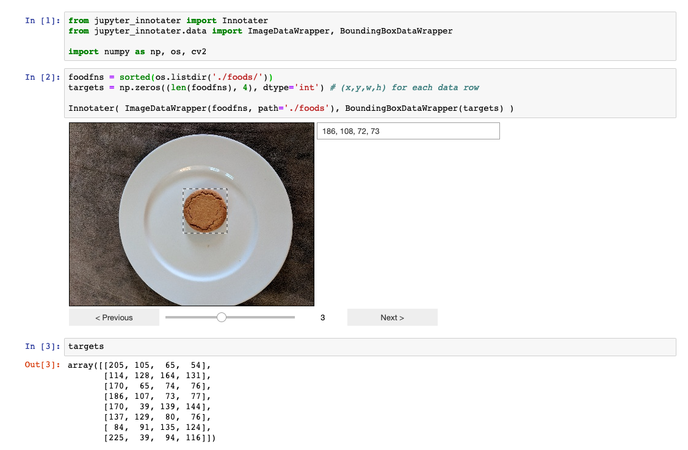
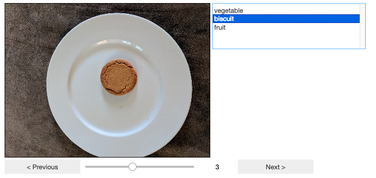
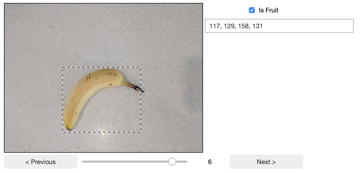

# jupyter-innotater

Annotate data including image bounding boxes inline within your [Jupyter notebook](https://jupyter.org/) in python.

## 1 - Overview

In a data science or machine learning project, you may prepare and study images or other data within a Jupyter notebook then need to annotate the data to augment the training or fix errors in your source data. You may need to check classifications are correct (cats/dogs correctly specified) or add bounding boxes around the pertinent parts of your images. For example, to build a dog breed classified you might first build a model that learns how to identify the bounding box of a dog within the image, then your final model zooms in on that box in order to train/evaluate the breed classifier.

Since you are already working within a Jupyter notebook, the Innotater works inline allowing you to interact with your data and annotate it quickly and easily, syncing straight back to your input data arrays or matrices.

Within Jupyter, you can easily home in on problem input data - perhaps only misclassified images - so you can step through and adjust bounding boxes just for those items. 

The Innotater widget is designed with a flexible API making it quick and easy to get started exploring your data, guessing how to work with your data without explicit configuration where possible.

The widget is currently in ALPHA development phase, and I appreciate all feedback on any problems including details on how the current code works or fails to work for the structure of your particular projects.



## 2 - Examples

### Images and Bounding Boxes

Load some images from filenames in an array, initialise empty bounding boxes.

Then set up Innotater to display the images so you can draw updated bounding boxes directly.

```
from jupyter_innotater import Innotater
from jupyter_innotater.data import ImageInnotation, BoundingBoxInnotation

import numpy as np, os

images = os.listdir('./foods/')
targets = np.zeros((len(images), 4)) # Initialise bounding boxes as x,y = 0,0, width,height = 0,0

Innotater( ImageInnotation(images, path='./foods'), BoundingBoxInnotation(targets) )
```


The widget allows you to interactively draw bounding boxes for any of the images, and the `targets` variable is always kept in sync with your changes.

```
import pandas as pd
df = pd.DataFrame(targets, columns=['x','y','w','h'])
df.to_csv('./bounding_boxes.csv', index=False)
```

The above saves your work - the bounding boxes you've drawn - as a CSV file. Without saving, your numbers will be lost if the kernel restarts.

### Multi-Classification of Images

Load some images from filenames in an array, initialise empty targets.

Then set up Innotater to display the images so you can mark the classes.

```
from jupyter_innotater import Innotater
from jupyter_innotater.data import ImageInnotation, MultiClassInnotation

import numpy as np, os, cv2

classes = ['vegetable', 'biscuit', 'fruit']
foods = [cv2.imread('./foods/'+f) for f in os.listdir('./foods/')]
targets = [0] * len(foods)

Innotater( ImageInnotation(foods), MultiClassInnotation(targets, classes=classes) )
```



The widget allows you to interactively step through the images selecting the classification, and the `targets` variable is always kept in sync with your changes.

### Binary-Classification with Bounding Boxes for Images

Set up Innotater to display the images so you can mark whether it is the object you are trying to detect, and draw bounding boxes if so.

```
from jupyter_innotater import Innotater
from jupyter_innotater.data import ImageInnotation, BoundingBoxInnotation, BinaryClassInnotation

import numpy as np, os

images = os.listdir('./foods/')
bboxes = np.zeros((len(images),4), dtype='int')
isfruits = np.ones((len(images),1), dtype='int')

Innotater(
        ImageInnotation(images, name='Food', path='./foods'), 
        [ BinaryClassInnotation(isfruits, name='Is Fruit'),
          BoundingBoxInnotation(bboxes, name='bbs', source='Food', desc='Food Type') ]
)

```



The widget allows you to interactively step through the images selecting the classification, and both `isfruits` and `bboxes` are always kept in sync with your changes.

```
result = np.concatenate([isfruits,bboxes], axis=-1); result
```

Output:

```
array([[  1, 173,  41, 135, 144],
       [  1, 138, 130,  79,  75],
       [  0,   0,   0,   0,   0],
       [  0,   0,   0,   0,   0],
       [  0,   0,   0,   0,   0],
       [  1, 205, 108,  62,  47],
       [  1, 117, 129, 158, 131],
       [  0,   0,   0,   0,   0]])
```

### Jupyter Notebook Example

The file Example/Examples.ipynb contains many examples you can run directly in Jupyter notebook.

For the full effect, you may need to install opencv2 and pandas packages (or just ignore those parts of the notebook):
```
pip install opencv-python
pip install pandas
```

## 3 - Usage Reference

### Innotater

```
Innotater( inputs, targets )
```

Instantiates the Jupyter widget. Each of `inputs` and `targets` is a Innotation subclass or array of Innotation subclasses.

The Innotation subclasses allow display and interaction with different types of input/target data. Typically, inputs contains one or more data source that is fixed in your project (e.g. images of dogs) and targets contains data that is intended to be modified through the widget.

To display the widget explicitly:
```
w = Innotater( inputs, targets )
display(w)
```

### Innotation subclasses

This is the base class (not to be instantiated directly).

The general constructor format for subclasses is:

```
Innotation( <array_like> data, [name=<string>,] [desc=<string>,])
```

Optionally, data can be specified as a `data=` keyword argument, in which case the positional data argument should be omitted.

`name` is optional unless required so that the Innotation can be specified as the source for another Innotation (e.g. to link the Bounding Box data with the image to which it applies).

`desc` is also optional, and defaults to the same value as `name`. It may be displayed as a text label next to the data in the widget. 

#### ImageInnotation

data is expected to be an array of filenames, blobs, or numpy arrays containing image data directly (RGB format).

Extra optional parameters:

`path` - a path to be prefixed to all filenames provided in data.

`width` and/or `height` to specify the maximum size of image to display. Currently just truncates the image - in the future some way to zoom to make large images manageable will be added. 

#### BoundingBoxInnotation

data is expected to be a 2-dimensional array with four columns corresponding to x,y,w,h - the top-left co-ordinates of the bounding boxes and width/height.

Displays a text box containing x,y,w,h as a string which can be edited directly or by drawing a bounding box on the corresponding ImageInnotation.

If there is only one ImageInnotation in the Innotater instance, that will be assumed to be the source image for this BoundingBoxInnotation. If there are multiple images, the source parameter will be needed (see below).

Extra parameters:

`source` - the `name` attribute of the corresponding ImageInnotation (required if there is ambiguity). Example:

```
Innotater( [ ImageInnotation(foodimages, name='food'), ImageInnotation(maskimages, name='mask'),], BoundingBoxInnotation(targets, source='food') )
```

In this example, the first image (with `name='food'`) will allow the user to draw a bounding box on it, and this will update the co-ordinates in the BoundingBoxInnotation (which has `source='food'`)

#### MultiClassInnotation

data is expected to be one of:

+ simple 1-dim array_like of integers representing the class index
+ 2-dim column vector (second dim has size 1) still containing only integers representing the class index
+ 2-dim one-hot encoding

Displays a list selection box so the user can choose one highlighted option. Currently does not support multiple selections per row.

Extra optional parameters:

`classes` - an array of string values containing text to display in place of the numerical class indices. 

#### BinaryClassInnotation

data is expected to be an array of True/False values.

Displays a checkbox.

Extra optional parameters:

`classes` - an array of two string values containing text to display in place of 'False' and 'True'. 


## 3 - Installation

### Install from PyPi (recommended)

```
pip install jupyter_innotater
```

### Development install

```
git clone https://github.com/ideonate/innotater

cd innotater/jupyter-innotater/js
npm install

cd ..
pip install -e .

jupyter nbextension install --py --symlink --sys-prefix jupyter_innotater
jupyter nbextension enable --py --sys-prefix jupyter_innotater
```

## 4 - Requirements

Innotater has been developed under Jupyter 5.7 with a Python 3.7 kernel. I will be pleased to look into any problems running under older versions of each.
    
## 5 - Contact for Feedback

Please get in touch with any feedback or questions: [dan@ideonate.com](dan@ideonate.com). It will be especially useful to understand the structure of your project and what is needed to augment your data - e.g. extra shape types, points, multiple bounding boxes. There are many ideas on the roadmap, and your input is vital for prioritising these.

## 6 - License

This code is released under an MIT license.

Many thanks to Github user ocoudray for the example [drawing-pad](https://github.com/ocoudray/jupyter-drawing-pad) and [first-widget](https://github.com/ocoudray/first-widget) demo Jupyter widgets.  
